# Mermaid ER-diagram szintaxis összefoglaló

A Mermaid entitás-kapcsolat (ER) diagramjai az `erDiagram` kulcsszóval kezdődnek.

## Alapstruktúra

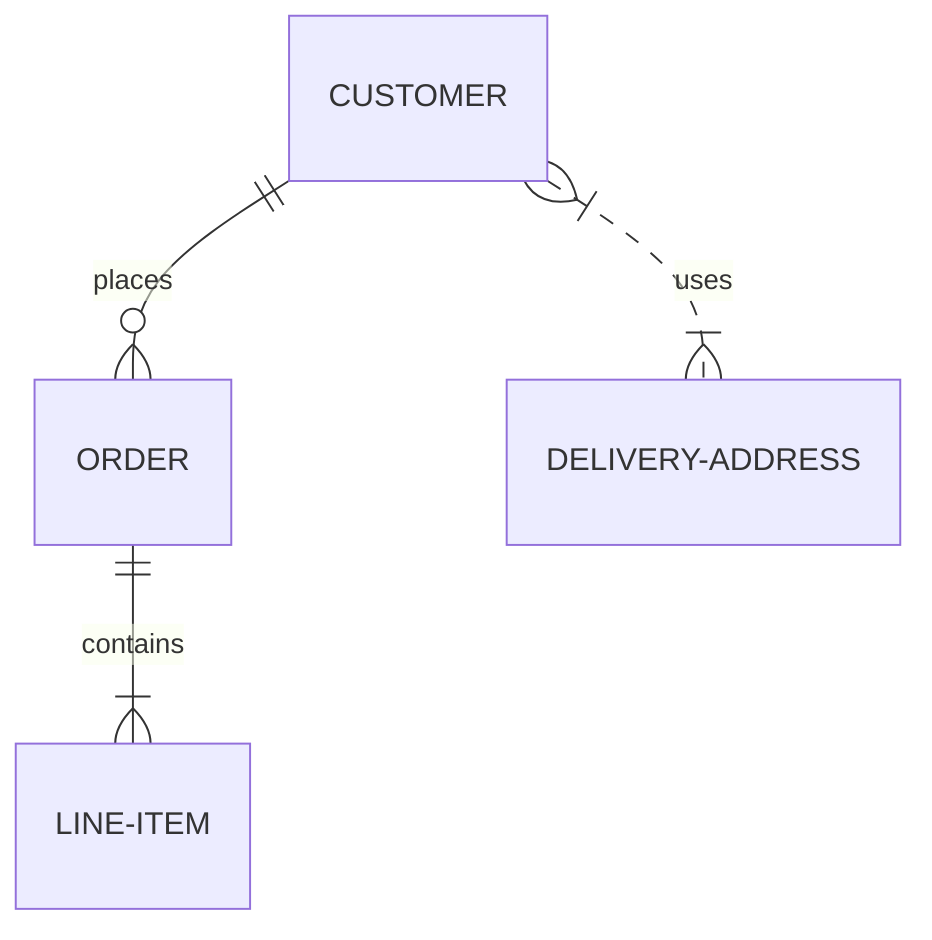


## Attribútumok megadása

Az entitáshoz kapcsos zárójelben lehet attribútumokat és típusokat felsorolni:

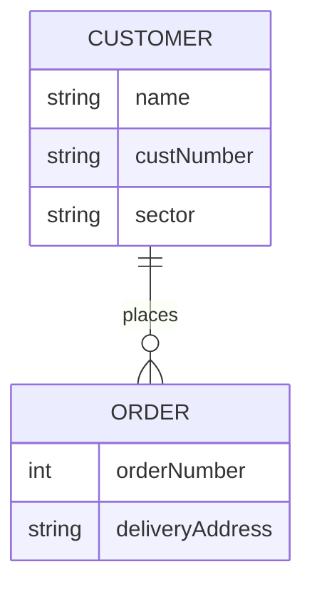

```
erDiagram
    CUSTOMER {
        string name
        string custNumber
        string sector
    }
    ORDER {
        int orderNumber
        string deliveryAddress
    }
    CUSTOMER ||--o{ ORDER : places
```
### Kulcsok jelölése

A `PK` (primary key), `FK` (foreign key), `UK` (unique key) kulcsszavakkal, illetve megjegyzéssel is elláthatók:

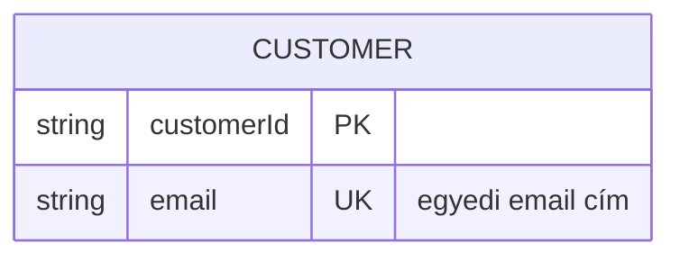

```
erDiagram
    CUSTOMER {        
        string customerId PK
        string email UK "egyedi email cím"        
    }
```

A `CUSTOMER` táblában a felhasználókat a `customerID`-val azonosítjuk, de nem engedünk két felhasználót ugyanazzal az e-mail címmel regisztrálni. 
## Több szavas / speciális entitásnevek

Kötőjelet, aláhúzást tartalmazó neveknél nincs gond, de ha szóköz vagy speciális karakter kell, idézőjelbe tegyük:

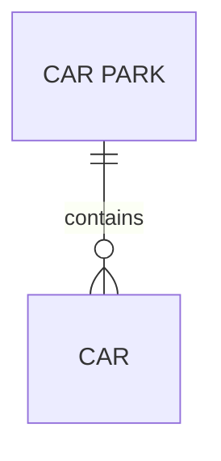
```
erDiagram
    "CAR PARK" ||--o{ CAR : contains
```

## Kapcsolat felirat nélkül

A `: kapcsolat_neve` rész elhagyható, de üres idézőjelet ajánlott hagyni a tisztább megjelenésért:

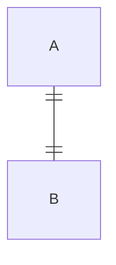

## Teljes példa

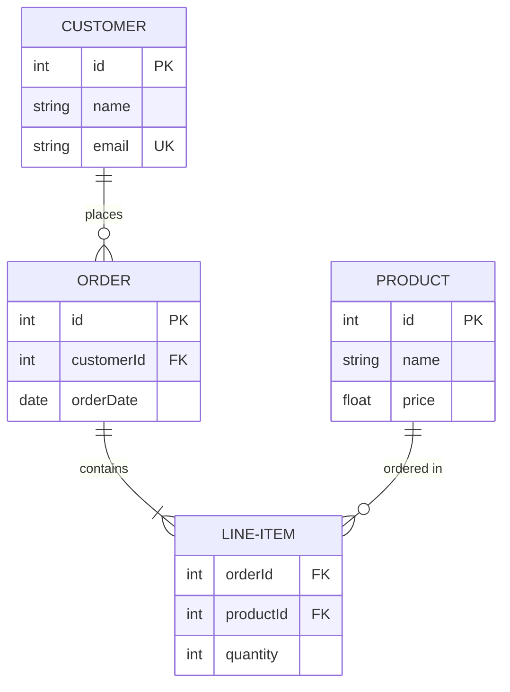

Ez egy webshop-adatmodellt ábrázol: egy vásárló több rendelést adhat le, egy rendelés több tételt tartalmazhat, és minden tétel egy termékhez kapcsolódik.

## 1. Egy-a-sokhoz (kötelező) — CUSTOMER / ORDER

Az `ORDER` tábla `customerId` mezője idegen kulcsként hivatkozik a `CUSTOMER` tábla elsődleges kulcsára.

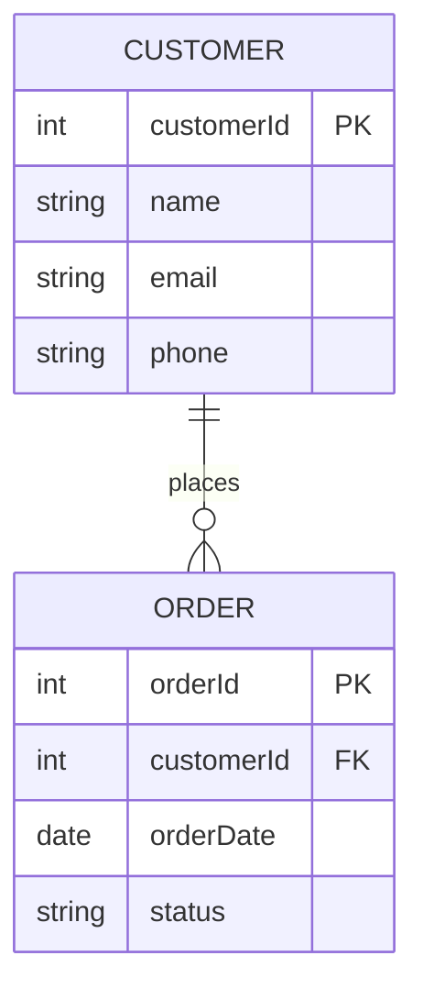

```
erDiagram
    CUSTOMER ||--o{ ORDER : places

    CUSTOMER {
        int customerId PK
        string name
        string email
        string phone
    }
    ORDER {
        int orderId PK
        int customerId FK
        date orderDate
        string status
    }
```

## 2. Egy-az-egyhez (kötelező mindkét oldalon) — PERSON / PASSPORT

A `PASSPORT` tábla `personId` mezője egyben idegen kulcs is és egyedi (`UK`) is, hiszen egy személyhez csak egy útlevél tartozhat.

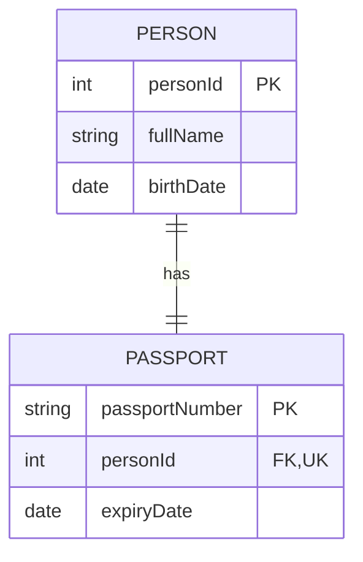

```
    PERSON ||--|| PASSPORT : has

    PERSON {
        int personId PK
        string fullName
        date birthDate
    }
    PASSPORT {
        string passportNumber PK
        int personId FK, UK        
        date expiryDate
    }
```

## 3. Egy-az-egyhez (opcionális) — EMPLOYEE / PARKING-SPOT

A `PARKING-SPOT` tábla `employeeId` mezője opcionális idegen kulcs (lehet üres/NULL is, ha nincs hozzárendelve alkalmazott).

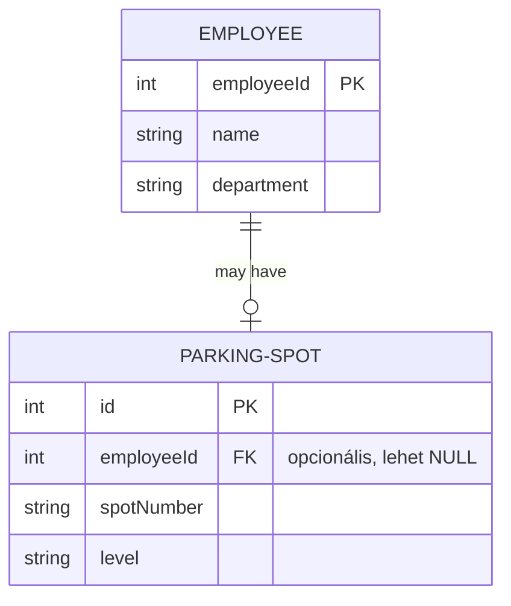

```
erDiagram
    EMPLOYEE ||--o| PARKING-SPOT : "may have"

    EMPLOYEE {
        int employeeId PK
        string name
        string department
    }
    PARKING-SPOT {
        int id PK
        int employeeId FK "opcionális, lehet NULL"
        string spotNumber
        string level
    }
```

## 4. Sok-a-sokhoz (kötelező) — STUDENT / COURSE

Sok-a-sokhoz kapcsolatnál egy köztes (kapcsoló) tábla szükséges, mert egy egyszerű idegen kulcs nem tudná kezelni, hogy mindkét oldalon több elem is állhat. Az `ENROLLMENT` tábla mindkét oldalra mutató idegen kulcsot tartalmaz, amelyek együtt alkotják az összetett elsődleges kulcsot.

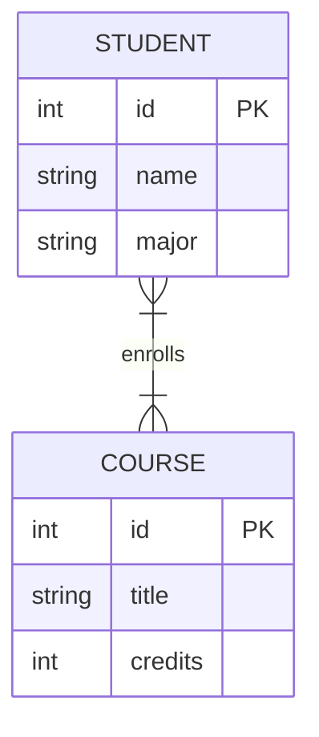


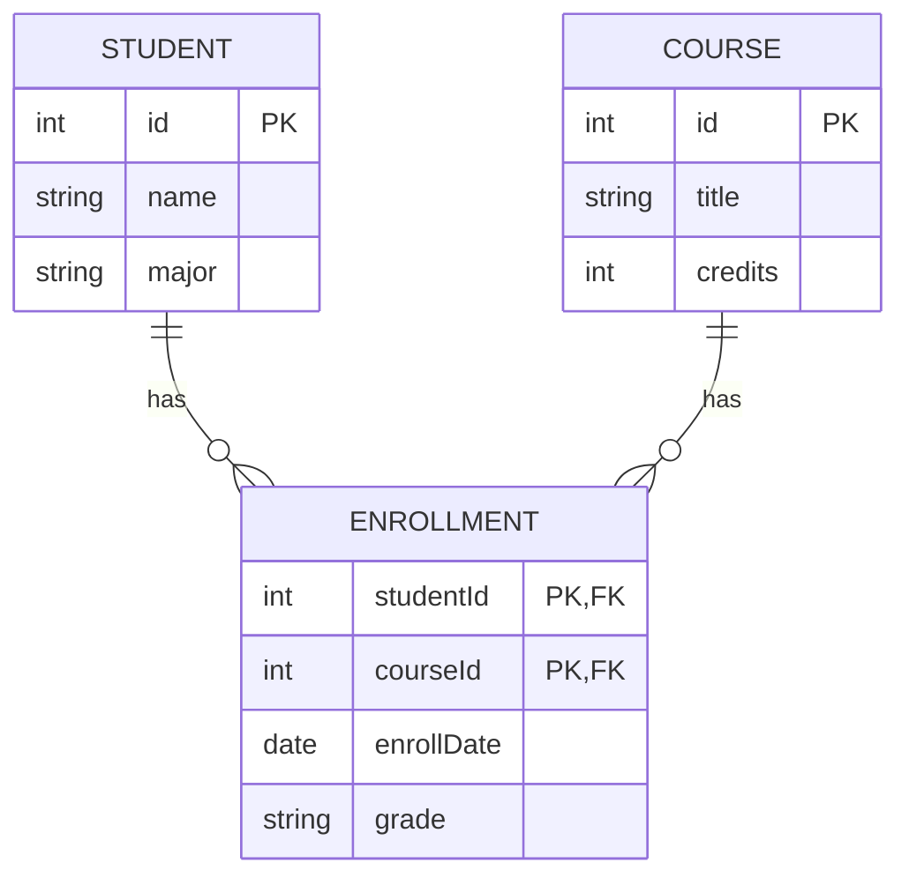


```
erDiagram
    STUDENT ||--o{ ENROLLMENT : has
    COURSE ||--o{ ENROLLMENT : has

    STUDENT {
        int id PK
        string name
        string major
    }
    COURSE {
        int id PK
        string title
        int credits
    }
    ENROLLMENT {
        int studentId PK, FK
        int courseId PK, FK
        date enrollDate
        string grade
    }
```

