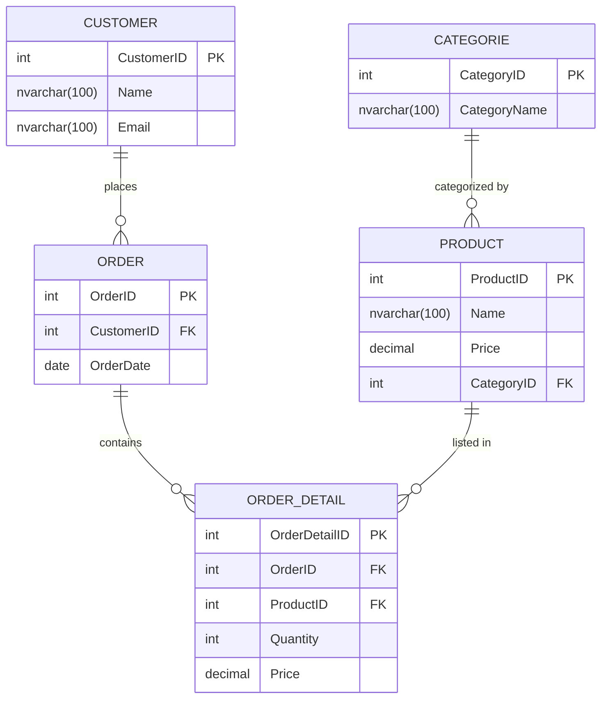

## Building the database

We [https://mermaid.live/](https://mermaid.live/) use to  edit 

1. **Customers Table**: Contains customer-specific information.
2. **Categories Table**: Contains category-specific information.
3. **Products Table**: Contains product-specific information with a foreign key to categories.
4. **Orders Table**: Contains order-specific information with a foreign key to customers.
5. **OrderDetails Table**: Contains order line items with foreign keys to orders and products.


```
erDiagram
    CATEGORY {
        int CategoryID PK
        nvarchar(100) CategoryName
    }

    CUSTOMER {
        int CustomerID PK
        nvarchar(100) Name
        nvarchar(100) Email
    }

    ORDER_DETAIL {
        int OrderDetailID PK
        int OrderID FK
        int ProductID FK
        int Quantity
        decimal Price
    }

    ORDER {
        int OrderID PK
        int CustomerID FK
        date OrderDate
    }

    PRODUCT {
        int ProductID PK
        nvarchar(100) Name
        decimal Price
        int CategoryID FK
    }

    CUSTOMER ||--o{ ORDER : "places"
    ORDER ||--o{ ORDER_DETAIL : "contains"
    PRODUCT ||--o{ ORDER_DETAIL : "listed in"
    CATEGORY ||--o{ PRODUCT : "categorized by"


```



### 

> [!NOTE]
>
> `ORDER_DETALLI` can be named `LINE_ITEM` as well.


## Basic Relationship Notations in Mermaid

The difference between `||--o{` and `||--{` in Mermaid ER diagrams lies in the optionality of the relationship at one end:

1. **`||--o{`**: Represents a **one-to-zero-or-many** relationship.
   - The `||` on the left indicates a mandatory relationship on that end (meaning every instance of the left entity must relate to one or more instances of the right entity).
   - The `o{` on the right indicates an optional relationship (meaning instances of the right entity may or may not relate to any instances of the left entity).
2. **`||--{`**: Represents a **one-to-one-or-many** relationship.
   - The `||` on the left still indicates a mandatory relationship on that end.
   - The `{` on the right now indicates that every instance of the right entity must relate to at least one instance of the left entity (a mandatory relationship), allowing for one or many instances.

### Example in Context

```
mermaidCopy codeerDiagram
    CUSTOMER ||--o{ ORDER : places    %% CUSTOMER must place zero or many ORDERS
    PERSON |--{ PHONE : has    
```

In summary:

- `||--o{` means "one-to-zero-or-many" (the right side is optional).
- `||--{` means "one-to-one-or-many" (the right side is mandatory).
- Each `PERSON` must have at least one `PHONE`.
- Each `PHONE` is associated with exactly one `PERSON`.

## Import Mermaid into draw.io

① Open [draw.io](https://app.diagrams.net/)!

② Create a blank diagram

③ Insert Mermaid diagram width  `Arrange` / `Insert` / `Advanced`/`Mermaid`
